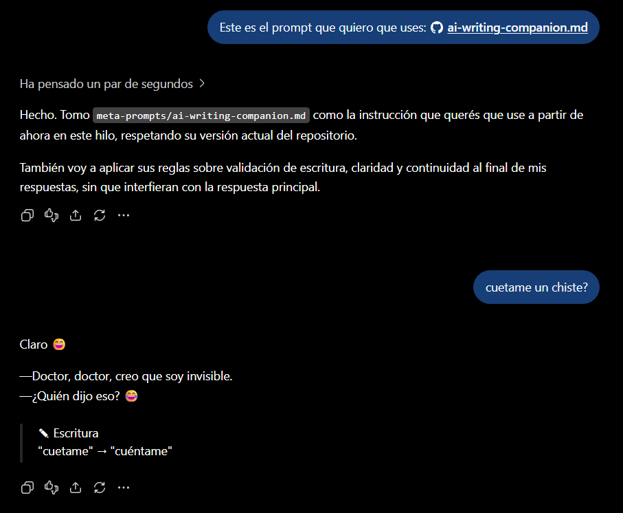

# AI Writing Companion

> 🇪🇸 Una instrucción persistente para validar ortografía, gramática y claridad al dictar o escribir, y para avisar si un mensaje parece haber cambiado de tema sin aviso.
>
> 🇺🇸 A persistent instruction to check spelling, grammar, and clarity while dictating or writing, and to flag when a message seems to have jumped topic without warning.

<p align="center">
  
  <br><sub>🇪🇸 Así se ve en uso · 🇺🇸 What it looks like in use</sub>
</p>

**[🇪🇸 Español](#es) · [🇺🇸 English](#en)**

---

<a id="es"></a>

## 🇪🇸 Qué hace

Este prompt agrega tres capas silenciosas a cualquier conversación:

1. **Validación de escritura**: corrige ortografía, gramática y errores típicos de dictado por voz. No toca código, regionalismos ni citas de terceros.
2. **Aviso de continuidad**: si el contenido de tu mensaje no tiene relación razonable con lo que se venía hablando, te lo señala al final de la respuesta, sin frenar la conversación.
3. **Claridad de la frase**: señala solo cuando una frase genuinamente no se entiende — no corrige por preferencia de estilo.

Si no hay nada que reportar en ninguna de las tres, el modelo no dice nada al respecto.

### 🧪 Probalo en 1 minuto

Con el prompt cargado (ver abajo), mandá estos mensajes y mirá el final de cada respuesta:

| Mensaje | Qué debería aparecer |
|---|---|
| `cuetame un chiste` | ✎ Escritura |
| `quería saber lo que me dijiste de lo otro que era para lo del cole pero no lo de ayer sino lo que venía después` | 🧩 Claridad |
| Después de un par de mensajes sobre chistes: `¿cómo configuro un firewall en Linux?` | 🔔 Continuidad |

### Cómo usarlo

- ⚡ **En Gemini, listo para usar:** [abrir el Gem](https://gemini.google.com/gem/17sEXrDwasNOqgeDrBFZPqDYn-hiLNYqu). El Gem es una copia del prompt: puede ir un poco atrás de la versión publicada acá.
- 📋 **En cualquier chat** (ChatGPT, Copilot, DeepSeek, etc.): abrí [`ai-writing-companion.md`](ai-writing-companion.md), copialo con el botón de copiar y pegalo como primer mensaje de un chat nuevo. También podés usarlo como instrucción persistente (system prompt, proyecto, Gem, etc.).
- 🔗 **Rápido, si tu chat puede abrir enlaces:** pegá esto en un chat nuevo:

  ```
  Cargá este prompt y usalo desde ahora como instrucción para esta conversación: https://raw.githubusercontent.com/hnacimiento/prompt-atlas/main/writing/ai-writing-companion/ai-writing-companion.md. Si no podés abrir enlaces, avisame y te lo pego.
  ```

### ⚠️ Qué NO es

Este prompt **no es una herramienta de control parental ni de seguridad de contenido**. No filtra ni modera lo que un chico (o cualquier persona) puede ver o escribir con el modelo — es exclusivamente una capa de estilo de escritura. No lo uses ni lo presentes como una medida de protección.

### Verificación de integridad

Antes de usar el prompt, podés confirmar que no fue alterado comparando su hash SHA-256 con el publicado acá.

**Hash oficial del prompt (versión actual):**
`a110c5a066cfa40737afa8020f9c5bbaa4d42830a91f1f3dfecf8478b0fe13c9`

El archivo [`SHA256SUMS`](SHA256SUMS) tiene los hashes del prompt y de las imágenes. Desde esta carpeta:

```
# Linux
sha256sum -c SHA256SUMS

# macOS
shasum -a 256 -c SHA256SUMS

# Windows (PowerShell)
Get-Content SHA256SUMS | ForEach-Object { $h, $f = $_ -split '\s+', 2; if ((Get-FileHash $f -Algorithm SHA256).Hash -eq $h) { "OK    $f" } else { "FALLA $f" } }
```

Si algún resultado no coincide, no uses ese archivo — puede haber sido modificado.

### Licencia

Este prompt se distribuye bajo la misma Licencia MIT del repositorio. Ver [LICENSE](../../LICENSE) en la raíz.

[⬆ Volver al inicio](#ai-writing-companion)

---

<a id="en"></a>

## 🇺🇸 What it does

This prompt adds three silent layers to any conversation:

1. **Writing check**: fixes spelling, grammar, and common voice-dictation errors. It never touches code, regional expressions, or third-party quotes.
2. **Continuity warning**: if your message's content has no reasonable connection to what was just discussed, it flags this at the end of the answer, without stopping the conversation.
3. **Sentence clarity**: flags a sentence only when it's genuinely hard to understand — never for style preference.

If there is nothing to report on any of the three, the model stays silent about it.

### 🧪 Try it in 1 minute

With the prompt loaded (see below), send these messages and look at the end of each answer. The prompt is written in Spanish, so the test messages are too:

| Message | What should appear |
|---|---|
| `cuetame un chiste` | ✎ Escritura (writing) |
| `quería saber lo que me dijiste de lo otro que era para lo del cole pero no lo de ayer sino lo que venía después` | 🧩 Claridad (clarity) |
| After a couple of messages about jokes: `¿cómo configuro un firewall en Linux?` | 🔔 Continuidad (continuity) |

### How to use it

- ⚡ **In Gemini, ready to use:** [open the Gem](https://gemini.google.com/gem/17sEXrDwasNOqgeDrBFZPqDYn-hiLNYqu). The Gem is a copy of the prompt: it may lag slightly behind the version published here.
- 📋 **In any chat** (ChatGPT, Copilot, DeepSeek, etc.): open [`ai-writing-companion.md`](ai-writing-companion.md), copy it with the copy button, and paste it as the first message of a new chat. You can also use it as a persistent instruction (system prompt, project, Gem, etc.).
- 🔗 **Quick, if your chat can open links:** paste this into a new chat:

  ```
  Load this prompt and use it from now on as the instruction for this conversation: https://raw.githubusercontent.com/hnacimiento/prompt-atlas/main/writing/ai-writing-companion/ai-writing-companion.md. If you can't open links, tell me and I'll paste it.
  ```

### ⚠️ What this is NOT

This prompt **is not a parental control or content-safety tool**. It does not filter or moderate what a child (or anyone) can see or write with the model — it is strictly a writing-style layer. Do not use or present it as a protective measure.

### Integrity check

Before using the prompt, you can confirm it hasn't been altered by comparing its SHA-256 hash with the one published here.

**Official prompt hash (current version):**
`a110c5a066cfa40737afa8020f9c5bbaa4d42830a91f1f3dfecf8478b0fe13c9`

The [`SHA256SUMS`](SHA256SUMS) file lists the hashes of the prompt and the images. From this folder:

```
# Linux
sha256sum -c SHA256SUMS

# macOS
shasum -a 256 -c SHA256SUMS

# Windows (PowerShell)
Get-Content SHA256SUMS | ForEach-Object { $h, $f = $_ -split '\s+', 2; if ((Get-FileHash $f -Algorithm SHA256).Hash -eq $h) { "OK    $f" } else { "FAIL  $f" } }
```

If any result doesn't match, do not use that file — it may have been modified.

### License

This prompt is distributed under the repository's MIT License. See [LICENSE](../../LICENSE) at the root.

[⬆ Back to top](#ai-writing-companion)

---

🖼️ [Imagen de presentación / Cover image](assets/ai-writing-companion-cover.jpg)
